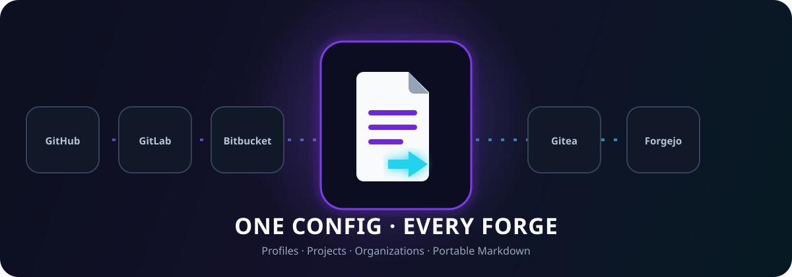
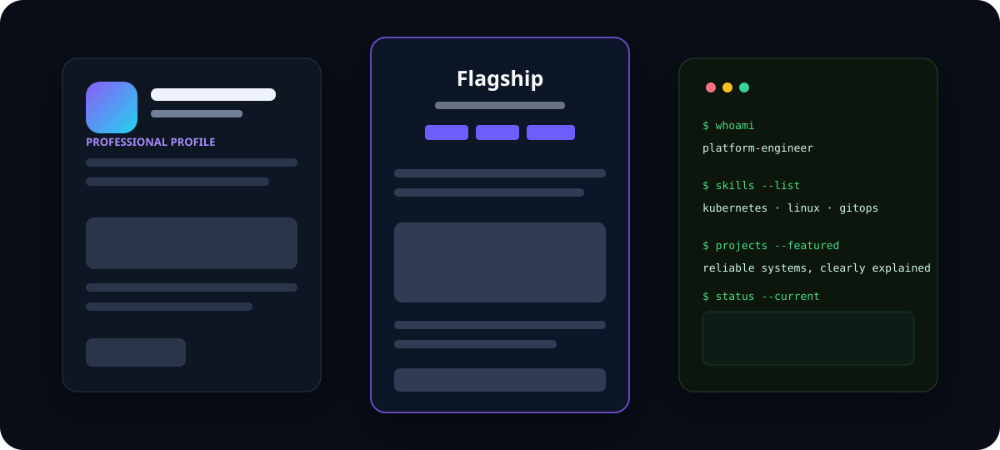

<div align="center">
  

  <h1>ReadmePort</h1>

  <p><strong>One config. Beautiful READMEs for every forge.</strong></p>

  <p>
    <a href="https://github.com/Yunushan/readme-port/actions/workflows/ci.yml"></a>
    
    
    
    <a href="LICENSE"></a>
  </p>

  <p>
    
    
    
    
    
  </p>

  <p>
    <a href="#quick-start">Quick Start</a> ·
    <a href="#template-gallery">Templates</a> ·
    <a href="#platform-support">Platforms</a> ·
    <a href="#configuration">Configuration</a> ·
    <a href="docs/GETTING_STARTED.md">User Guide</a> ·
    <a href="CONTRIBUTING.md">Contributing</a> ·
    <a href="LICENSE">License</a>
  </p>
</div>



ReadmePort is an editable README toolkit for **projects, developer profiles, and organizations**. Use the local Studio, the zero-dependency CLI, or copy a clean rendered example. The generator keeps portable Markdown as the safe baseline, derives provider-aware repository links and placement guidance, and preserves your hand-written regions across regeneration. It generates files locally; it never creates or pushes forge repositories.

## Why ReadmePort

| Capability | Included |
| --- | --- |
| **One source of truth** | Maintain content in a readable JSON file with an editor-friendly schema. |
| **Seven useful templates** | Project, documentation, professional profile, terminal profile, minimal, and community layouts. |
| **Five forge adapters** | GitHub, GitLab, Gitea, Forgejo, and Bitbucket Cloud, plus a provider-neutral portable target. |
| **Portable + enhanced modes** | Start with conservative Markdown; add safe host-specific presentation only where it is supported. |
| **Manual regions** | Keep hand-written notes between builds without maintaining a fork of generated output. |
| **Local visual Studio** | Configure, preview, import, export, copy, and save without an account, analytics, or API token. |
| **Guardrails** | Refuses accidental overwrite, flags unsafe URLs, checks unresolved variables, and warns about external images. |
| **No runtime dependencies** | Runs on a supported Node.js 22+ release with the standard library alone. |

## Quick start

Install directly from the GitHub repository, then run ReadmePort **inside the repository that should receive the README**:

```bash
npm install --global github:Yunushan/readme-port
cd /path/to/your-target-repository

# Create an editable starter configuration
readme-port init --kind project

# Generate README.md (the first intentional replacement needs --force)
readme-port build --force
```

Edit `readme-port.config.json`, then regenerate with:

```bash
readme-port build
```

Generate every provider variant at once:

```bash
readme-port build --provider all --output dist
```

Multi-provider files are staging outputs. Copy the selected `dist/{provider}/README.md` to that provider repository's required path; assets and relative links are intentionally resolved from the destination repository, not the staging directory.

## Choose your workflow

| Workflow | Best for | Start with |
| --- | --- | --- |
| **Studio** | Visual editing and an approximate local preview | `readme-port serve` |
| **CLI** | Repeatable builds, CI checks, and multi-provider output | `readme-port init` |
| **Copy rendered Markdown** | A one-off README with no generator syntax | Browse [`examples/generated/`](examples/generated/) |
| **Eject** | Full layout control while retaining configuration-driven builds | `readme-port eject` |

Studio opens at `http://127.0.0.1:4173/web/`. Everything stays in your browser. Import a configuration explicitly; Save actions create browser downloads rather than writing the current working directory. Use the CLI for direct file writes.

## Template gallery



| Type | Template ID | Style |
| --- | --- | --- |
| Project | `project/flagship` | Rich landing page with badges, navigation, features, setup, usage, configuration, and roadmap |
| Project | `project/minimal` | Compact overview, quick start, usage, contribution, and license |
| Project | `project/docs-hub` | Documentation map, technology map, configuration reference, and operations notes |
| Profile | `profile/professional` | Recruiter-friendly overview, expertise, selected work, and contact links |
| Profile | `profile/terminal` | Terminal-inspired layout that remains readable without HTML |
| Profile | `profile/minimal` | Low-maintenance personal profile focused on signal |
| Organization | `organization/community` | Mission, values, projects, participation, governance, and notices |

View rendered reference outputs in [`examples/generated/`](examples/generated/) and the project, profile, and organization source configurations in [`examples/`](examples/). When copying one into another repository, update its example links and asset paths.

## Platform support

| Platform | Project README | Native profile placement | Enhanced layout |
| --- | :---: | --- | :---: |
| GitHub | Yes | Root `README.md` in public repository `{username}` | Yes |
| GitLab | Yes | Root README in public, case-sensitive project `{username}/{username}` | Yes |
| Gitea | Yes | Root `README.md` in public repository named `.profile` | Portable default |
| Forgejo | Yes | Root `README.md` in public, non-fork repository named `.profile` | Portable default |
| Bitbucket Cloud | Yes | **No documented native profile README** | Portable only |

“Support” means the generated repository README uses the target's documented Markdown baseline. It does not pretend every provider has GitHub's profile-repository feature. Self-hosted Gitea and Forgejo installations can vary by version and sanitizer configuration; set `provider.baseUrl` and use portable mode unless you have tested the instance. Bitbucket Cloud Issues are being removed on **August 20, 2026**, so Bitbucket configurations should set `links.support` to Jira or another external tracker.

See the [full compatibility and placement guide](docs/PLATFORMS.md).

## Configuration

```json
{
  "$schema": "https://raw.githubusercontent.com/Yunushan/readme-port/main/schema/readme-port.schema.json",
  "schemaVersion": 1,
  "kind": "project",
  "template": "project/flagship",
  "provider": {
    "id": "github",
    "mode": "enhanced",
    "baseUrl": "https://github.com"
  },
  "theme": "midnight",
  "branding": {
    "title": "Your Project",
    "tagline": "A precise promise for the people who need this project."
  },
  "repository": {
    "owner": "your-username",
    "name": "your-project",
    "defaultBranch": "main"
  },
  "features": [
    {
      "title": "Portable",
      "description": "Renders cleanly across modern code forges."
    }
  ],
  "license": {
    "name": "MIT License",
    "spdx": "MIT",
    "url": "LICENSE"
  }
}
```

The schema covers badges, navigation, installation, usage, configuration tables, roadmaps, skills, selected projects, social links, license metadata, custom template data, and safety options. Start from [`examples/project.config.json`](examples/project.config.json), [`examples/profile.config.json`](examples/profile.config.json), or [`examples/organization.config.json`](examples/organization.config.json).

## Preserve hand-written content

Write inside a manual region in the generated README:

```markdown
[readme-port-manual-start-project-notes]: # (readme-port:manual)
These notes are maintained by hand.
[readme-port-manual-end-project-notes]: # (/readme-port:manual)
```

The next build carries this content forward. Duplicate IDs or unbalanced markers fail `doctor` checks.

## CLI reference

| Command | Purpose |
| --- | --- |
| `init` | Create a project, profile, or organization starter config |
| `build` | Render one provider or all providers |
| `check` | Fail when committed generated output is stale |
| `validate` | Validate configuration and provider choices |
| `doctor` | Inspect compatibility, unresolved tokens, manual markers, links, and external images |
| `eject` | Copy the active template into the project for direct editing |
| `list` | Show templates, providers, or themes |
| `serve` | Start the local Studio with Node's built-in HTTP server |

Run `readme-port --help` for every option.

## Repository map

```text
templates/           Editable Markdown templates
themes/              Reusable theme metadata
src/core/            Browser-safe rendering, validation, and provider adapters
src/node/            CLI, filesystem, checks, and local server
web/                 Local-only visual Studio
schema/              JSON Schema for editor completion
examples/            Starter configs and generated outputs
docs/                Guides for users, platforms, and template authors
.github/ .gitlab/    Provider-native community and CI metadata
.gitea/ .forgejo/    Gitea and Forgejo community and CI metadata
```

## Quality and privacy

- No account, network API, token, backend, analytics, or telemetry is required.
- Imported JSON cannot execute code through the template engine.
- Unsafe, control-obfuscated, and non-web URL schemes are rejected in URL-bearing fields.
- Dynamic cards and external badges are opt-in because they can fail or disclose reader requests.
- Output writes are atomic, and an unrecognized README is protected unless `--force` is explicit.
- Bundled SVG artwork is original; no profile artwork was copied from the inspiration sources.

## Documentation

- [Getting started](docs/GETTING_STARTED.md)
- [Customization, themes, and manual regions](docs/CUSTOMIZATION.md)
- [Platform compatibility](docs/PLATFORMS.md)
- [Template authoring](docs/TEMPLATE_AUTHORING.md)
- [Support](SUPPORT.md)
- [Security policy](SECURITY.md)
- [Changelog](CHANGELOG.md)

## Contributing

Issues and pull requests are welcome. Read [CONTRIBUTING.md](CONTRIBUTING.md), run `npm run ci`, and include a generated example for template changes.

## Inspiration and attribution

ReadmePort uses original code, templates, copy, and artwork. Its product direction was informed by [Awesome GitHub Profile README](https://github.com/abhisheknaiidu/awesome-github-profile-readme), the [GitHub profile README topic](https://github.com/topics/github-profile-readme), the [community inspiration thread](https://www.reddit.com/r/github/comments/uulygm/what_are_some_really_nice_github_profile_readmes/), and [Best README Template](https://github.com/othneildrew/Best-README-Template). See [third-party notices](THIRD_PARTY_NOTICES.md).

## License

ReadmePort is free and open source under the [MIT License](LICENSE). Copyright © 2026 Yunus Çoğal.
